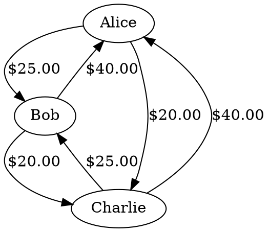

# expense-splitter (MCP tool for splitting group expenses)

An expense-splitting MCP server that models group debts as a directed graph.
It supports equal, percentage, and weight-based splits, then produces clear
settlements and an exportable DOT graph of all obligations.

Demo videos:

[](https://www.youtube.com/watch?v=qaERm_77g3g)
[](https://www.youtube.com/watch?v=mtDUmyAv6IU)

## Why this exists

Expense splitting is naturally a graph problem: people are nodes, and each
expense adds directed edges (who owes whom, and how much). This tool keeps that
model explicit, making settlement math transparent and easy to audit.

## Features

- Graph-based debt model with DOT export for visualization.
- MCP elicit flows for missing inputs (group name, members, amounts, splits).
- Split methods: `equal`, `percentage`, `weights`.
- Clear settlements derived from the raw debt graph.
- Simple, in-memory group store (no external database).

## Tooling overview

These tools are exposed via MCP:

- `create_group`: create a new group.
- `list_groups`: list all groups in memory.
- `add_people`: add one or more people to a group.
- `add_expense`: add an expense with split details.
- `get_group_info`: returns members, settlement details, and DOT graph.

## Getting started

### Requirements

- Go `1.25.1` (as declared in `go.mod`).
- Optional: Graphviz if you want to render DOT graphs as images.

### How to use this MCP server (stdio)

Configure your MCP client to launch the server via stdio. First compile the binary and copy it to `/tmp/`. Then configure Claude Desktop to use the MCP tool locally.

```bash
go build .
cp expense-splitter /tmp/expense-splitter
```

To use it with a demo agent that I built, see instructions in:
https://github.com/vnaveen-mh/expense-splitter-demo-agent

### Example flow (conversation style)

```
User: create a group called napa-trip
Agent: OK — group created.

User: add alice, bob, charlie to the group
Agent: Added Alice, Bob, and Charlie.

User: add an expense by alice for lunch, 120
Agent: Expense added.

User: get group details
Agent: returns members, settlements, and a DOT graph
```

## DOT graph export

The `get_group_info` tool returns a `graph_dot` field that you can paste into
Graphviz tools:



Render to PNG with Graphviz:

```bash
dot -Tpng temp.dot -o temp.png
```

## Notes

- All groups and expenses are stored in memory only (no persistence).
- Group names and person names are validated for simple, readable identifiers.
- Privacy/logging: info-level logs avoid names and amounts; enable debug-level logs only when you need detailed troubleshooting output.
